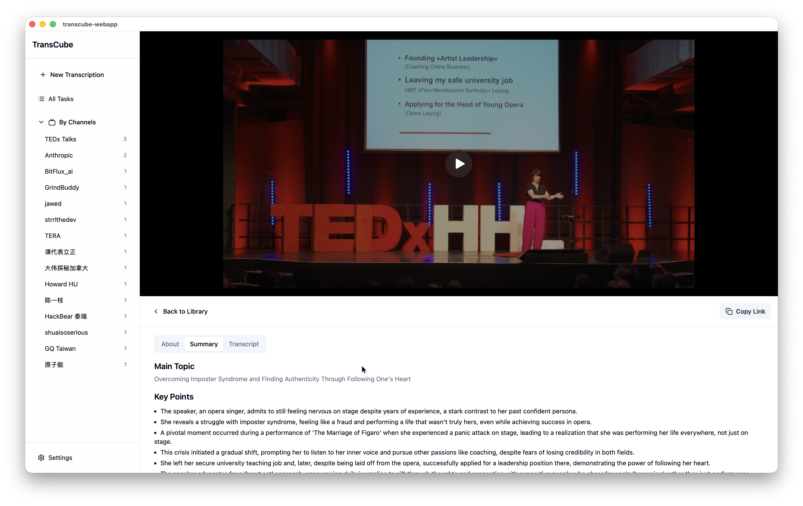

# TransCube

A desktop application for transcribing and translating videos with AI-powered speech recognition.



## ✨ Features

- 🎥 **Video Download & Processing** - Download videos from YouTube and other platforms
- 🎯 **AI Transcription** - Accurate speech-to-text using advanced AI models
- 🌍 **Multi-language Support** - Transcribe content in multiple languages
- 📝 **Smart Summaries** - Generate AI-powered summaries of your video content
- 💾 **Local Storage** - All your transcriptions are saved locally for privacy
- 🎨 **Modern UI** - Clean and intuitive interface built with React
- 🖥️ **Cross-platform** - Works on macOS, Windows, and Linux

## 🚀 Quick Start

### Prerequisites

Before running TransCube, make sure you have these tools installed:

- **yt-dlp** - For downloading videos
- **ffmpeg** - For audio processing
- **yap** - For AI transcription

### Installation

#### Using Homebrew (macOS)

Note: Requires macOS 14 (Sonoma) or later.

```bash
brew install --cask strrl/collective/transcube
```

#### Manual Installation

1. Download the latest release for your platform from the [Releases page](https://github.com/strrl/transcube-webapp/releases)
2. Install and run the application
3. Configure your workspace folder in Settings
4. (Optional) Add your OpenRouter API key for AI summaries

### Building from Source

If you want to build TransCube yourself:

```bash
# Clone the repository
git clone https://github.com/strrl/transcube-webapp.git
cd transcube-webapp

# Install dependencies
cd frontend && npm install && cd ..

# Run in development mode
wails dev

# Build for production
wails build
```

## 📖 How to Use

1. **Add a Video**: Paste a video URL in the input field and click "Start Transcription"
2. **Select Language**: Choose the source language of the video
3. **Wait for Processing**: The app will download, extract audio, and transcribe the video
4. **View Results**: Click on any completed video to view its transcription
5. **Generate Summary**: Use the AI summary feature to get key points from long videos

## 🛠️ Development

### Tech Stack

- **Backend**: Go 1.23 with Wails framework
- **Frontend**: React 18 + TypeScript + Vite
- **UI Components**: Radix UI + Tailwind CSS
- **Video Processing**: yt-dlp + ffmpeg
- **AI Transcription**: yap (Yet Another Processor)

### Project Structure

```
transcube-webapp/
├── app.go              # Main application logic
├── frontend/           # React frontend application
│   ├── src/           # React components and pages
│   └── wailsjs/       # Auto-generated Wails bindings
├── internal/          # Go internal packages
│   ├── services/      # Business logic services
│   └── types/         # Type definitions
└── build/             # Build configurations
```

### Development Commands

```bash
# Start development server with hot reload
wails dev

# Build production binary
wails build

# Run frontend only
cd frontend && npm run dev

# Update Go dependencies
go mod tidy
```

## 🤝 Contributing

Contributions are welcome! Please feel free to submit a Pull Request.

1. Fork the repository
2. Create your feature branch (`git checkout -b feature/AmazingFeature`)
3. Commit your changes (`git commit -m 'Add some AmazingFeature'`)
4. Push to the branch (`git push origin feature/AmazingFeature`)
5. Open a Pull Request

## 📄 License

This project is licensed under the MIT License - see the [LICENSE](LICENSE) file for details.

## 🙏 Acknowledgments

- [Wails](https://wails.io) - The fantastic framework for building desktop apps with Go
- [yt-dlp](https://github.com/yt-dlp/yt-dlp) - For reliable video downloading
- [ffmpeg](https://ffmpeg.org) - For audio/video processing
- All the open source contributors who made this project possible

## 📬 Support

If you encounter any issues or have questions, please [open an issue](https://github.com/strrl/transcube-webapp/issues) on GitHub.

---

Built with ❤️ by [Boring Design LLC](https://boringboring.design)
